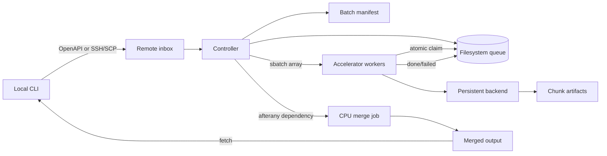
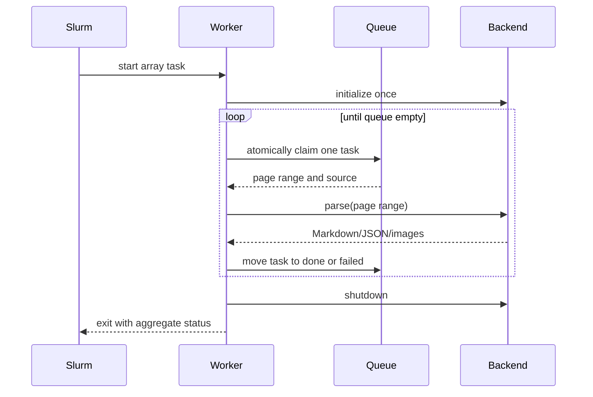

# 架构

## 设计目标

scnet-ocrdrop 把“文件投递”和“OCR 模型执行”分开：

- 本机通过 OpenAPI 或 SSH 负责上传、查询和下载；
- 登录节点只负责轻量控制逻辑和 Slurm 提交；
- OCR 模型只能在 Slurm 分配的计算节点运行；
- backend 可替换，队列、重试和结果生命周期保持一致。

## 组件关系



### Local CLI

`src/ocrdrop/client.py`

- 校验本地输入；
- 从 XDG 配置选择 transport 和 OCR backend；
- 从 Keychain、Secret Service 或环境变量读取 OpenAPI 凭据；
- 创建一次上传目录，并使用 OpenAPI 或 SCP 上传文件；
- 通过 SSH 调用远端控制器，或提交 OpenAPI CPU 控制作业；
- 等待状态和取回结果；
- 默认隐藏个人绝对路径和凭据字段；
- 不加载 OCR 模型。

### Transport

`src/ocrdrop/transports.py`

- `SSHTransport` 保留原有 SSH/SCP 行为；
- `OpenAPITransport` 负责区域发现、efile 文件传输和 HPC 控制作业；
- transport 不改变远端队列、worker、merge 或 OCR backend 契约；
- setup 可以启用多个 OpenAPI 区域，但每个操作只解析一个显式或默认区域；
- OpenAPI 的 `wait` 直接读取 manifest 和 queue，不为轮询重复提交作业。

### Remote controller

`src/ocrdrop/remote.py`

- 登录节点使用 Python 标准库运行；
- 使用 `pdfinfo` 获取页数；
- 为每个文档生成稳定的 document ID；
- 生成批次 manifest 和分片任务；
- 生成并提交 Slurm worker array；
- 提交依赖 worker 的 CPU merge job。

### Filesystem queue

```text
batches/<batch-id>/
├── manifest.json
├── queue/
│   ├── pending/
│   ├── running/
│   ├── done/
│   └── failed/
├── chunks/
├── errors/
├── logs/
├── output/
└── slurm/
```

worker 使用同一共享文件系统上的原子 `rename`：

```text
pending/task.json
        │ claim
        ▼
running/task.<job>.<pid>.json
        ├── success → done/task.json
        └── error   → failed/task.json
```

它不依赖 Redis、数据库或常驻服务。共享文件系统必须对登录节点和计算节点可见，并
支持同一文件系统内的原子 rename。

## Worker 生命周期



模型常驻是长文档吞吐的关键。冷启动只发生一次，后续分片复用同一个 backend
实例和已读取的源 PDF。

## Backend 边界

backend 负责：

- 验证运行时主版本；
- 在 worker 启动时初始化模型；
- 解析指定 PDF 页范围；
- 输出可被合并层识别的 Markdown、JSON 和图片；
- worker 退出时释放进程池等资源。

共享层负责：

- 文件传输；
- 文档哈希；
- 页数与分片；
- Slurm 资源与依赖；
- 队列状态；
- 重试；
- 合并；
- 结果取回。

PaddleOCR 已复用这套调度系统：backend 只实现按页渲染、OCR 和标准产物转换，
无需复制上传、Slurm、队列、重试或 fetch 逻辑。

## 合并契约

每个任务必须返回一个产物目录。合并层：

1. 按 `start_page_id` 排序；
2. 合并 Markdown，并插入明确的页区间注释；
3. 为图片增加页范围前缀，避免重名；
4. 修正使用局部分页编号的 backend JSON；
5. 保留每个 chunk 的原始任务记录；
6. 在文档 manifest 中标明跨分片内容需要复核。

MinerU 3 的 `pdf_info` 使用局部分页编号，需要增加分片偏移；MinerU 4 页范围接口
和 PaddleOCR `middle.json` 已经保留源 PDF 页码，不能重复偏移。PaddleOCR 的
`content_list.json` 使用分片局部页码，由共享合并层统一增加偏移。新的 backend
必须在测试中明确自己的页码语义。

## 故障模型

| 故障 | 表现 | 恢复 |
| --- | --- | --- |
| backend 抛异常 | 任务进入 `failed/`，保存 traceback | `retry` |
| 节点中断 | 任务可能留在 `running/` | 确认作业结束后 `retry --include-running` |
| 部分任务失败 | merge 生成成功部分，批次为 `partial` | 重试后重新 merge |
| 本机断线 | Slurm 任务继续运行 | 之后 `status` / `wait` / `fetch` |
| merge 失败 | chunk 仍保留 | 修复后重新执行 merge |

## 安全边界

- 真实配置放在 `config.local/`，不进入 Git；
- AK/SK 放在系统凭据库或进程环境，不进入 JSON 配置；
- 本机配置目录为 `0700`、文件为 `0600`；
- SSH 认证交给用户现有 OpenSSH 配置；
- CLI 不读取或保存私钥；
- OpenAPI home path 只在内存中用于解析 home-relative deployment root；
- 远端路径来自显式配置；
- batch ID 仅允许字母、数字、点、下划线和连字符；
- fetch 后的结果 manifest 不包含源文件绝对路径、输出目录或节点名；
- 命令输出默认隐藏个人绝对路径，`--show-paths` 只用于本地诊断。
